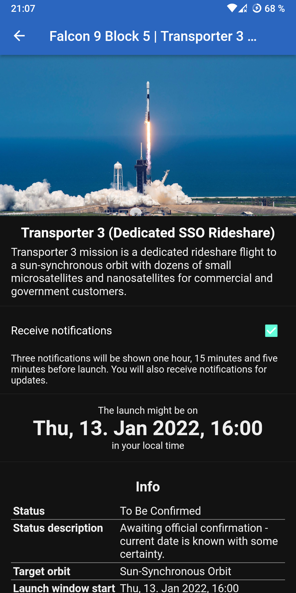
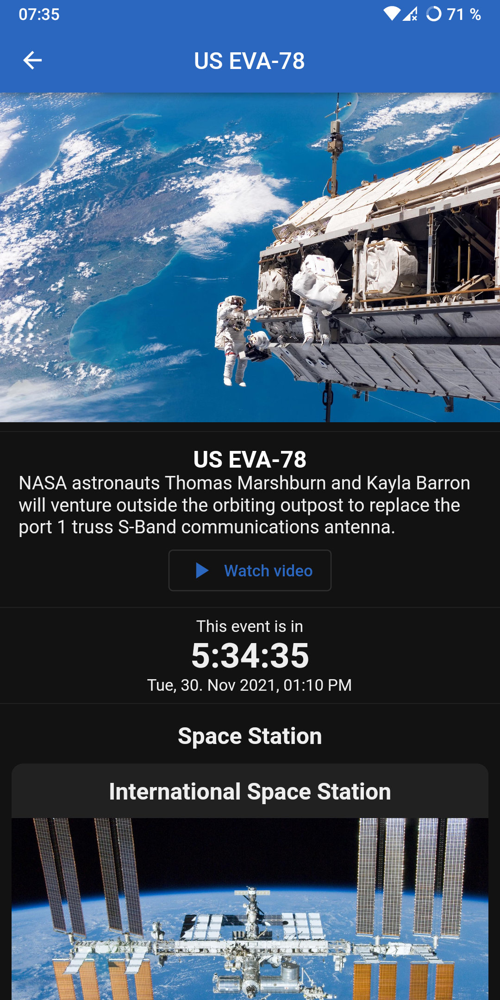
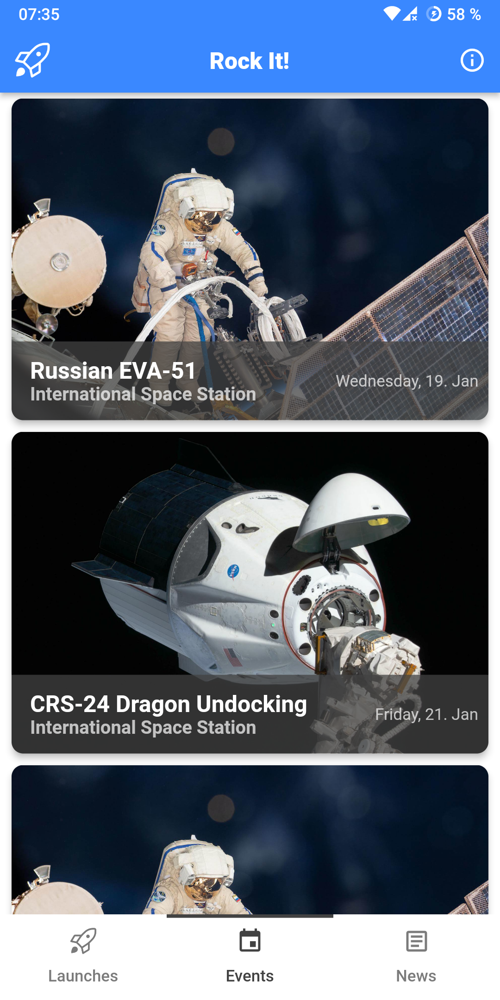
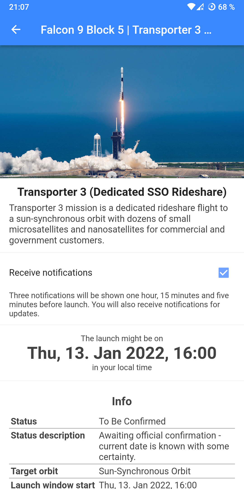
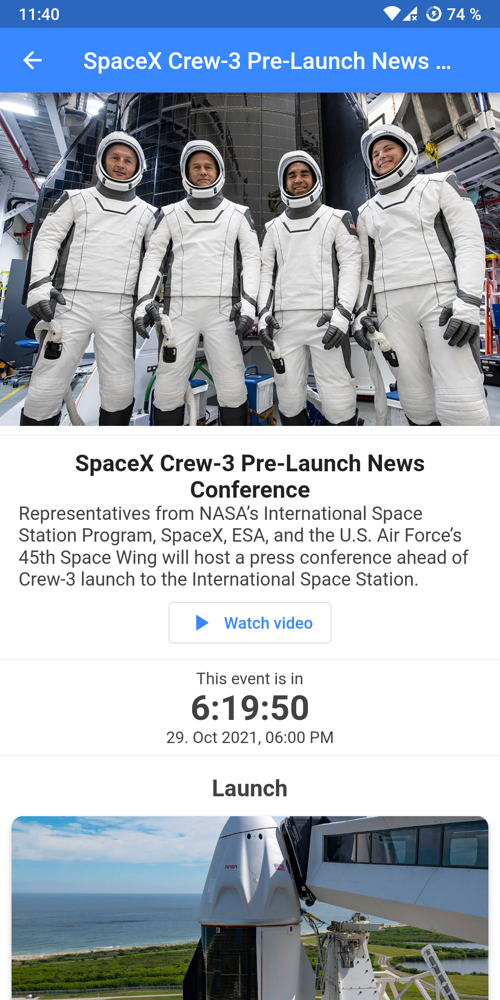

# rockit
Rock It! is an Android app that helps you stay informed on all things space. It displays upcoming launches and current space news curated by [The Space Devs](https://thespacedevs.com/).

### Features
- List upcoming launches and events (e.g. space station activity)
- Show launch/event details and a countdown
- List latest space news articles
- Localization for English and German (UI only, data is in English)
- No internet? No problem! The app caches offline content for a few days and updates it when connected to the internet

### Anti-Features
There's also one [Anti-Feature](https://f-droid.org/wiki/page/AntiFeatures) as defined by F-Droid: this app connects to [Non-Free Network Services](https://f-droid.org/docs/Anti-Features/#NonFreeNet) because it needs to get launch data.

### Credits
All data this app uses is curated by [The Space Devs](https://thespacedevs.com/). This app uses the [Launch Library 2](https://thespacedevs.com/llapi) and [Spaceflight News](https://thespacedevs.com/snapi) APIs.

### Screenshots (dark/light mode)
|                        Launches listing                        |                   Events listing                    |                        Space news                        |
| :------------------------------------------------------------: | :-------------------------------------------------: | :------------------------------------------------------: |
|  |  |  |

|                   Launch details                    |                   Event details                   |
| :-------------------------------------------------: | :-----------------------------------------------: |
|  |  |

|                        Launches listing                        |                   Events listing                    |                        Space news                        |
| :------------------------------------------------------------: | :-------------------------------------------------: | :------------------------------------------------------: |
|  |  |  |

|                   Launch details                    |                   Event details                   |
| :-------------------------------------------------: | :-----------------------------------------------: |
|  |  |

### Installation & updates
If you have [F-Droid](https://f-droid.org/) installed, you can add [my repository](https://github.com/xarantolus/fdroid). Make sure you have "Include anti-feature apps" enabled in settings. Then just search for "rockit" in the F-Droid client to download. You will receive update notifications.

Alternatively, you can [download the APK file from the releases section of this repository](https://github.com/xarantolus/rockit/releases/latest). Then open it from the file manager to install it. Please note that you will not receive any update notifications when going this route.

### [License](LICENSE)
This is free as in freedom software. Do whatever you like with it.
